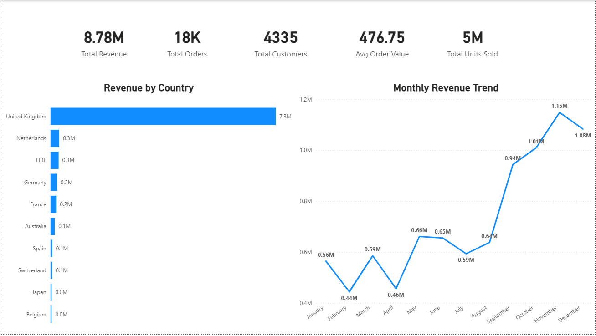
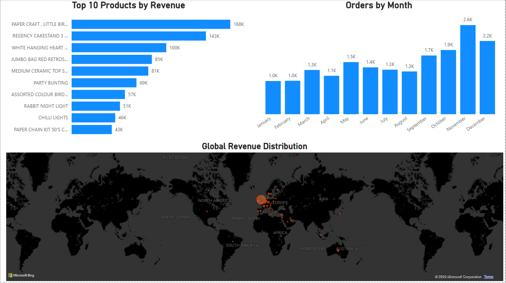
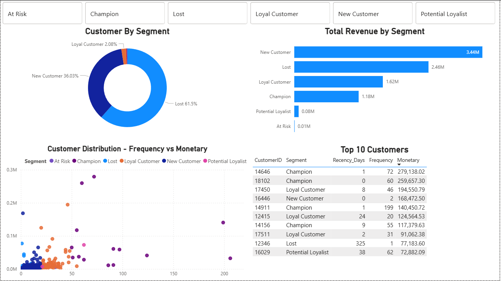
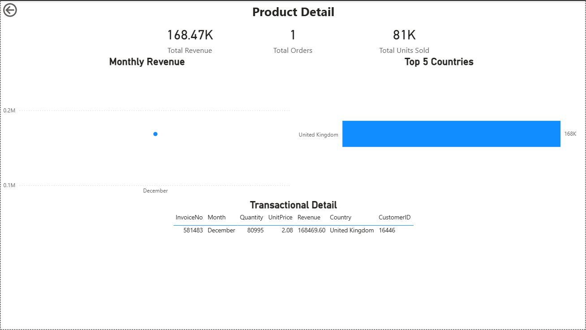

# 📊 E-Commerce Power BI Dashboard

## 📌 Project Overview
Interactive Power BI dashboard analyzing 541,909 e-commerce transactions
from a UK retailer. Built on cleaned SQL data, featuring RFM customer 
segmentation, sales trends, and product drill-through capability.

## 🛠️ Tools Used
- Power BI Desktop (DAX, Power Query)
- SQL Server (data source)
- Dataset: [UK E-Commerce Data — Kaggle](https://www.kaggle.com/datasets/carrie1/ecommerce-data)

## 📋 Dashboard Pages

| Page | Description |
|------|-------------|
| **Overview** | KPI cards — Revenue, Orders, Customers, Avg Order Value |
| **Sales Analysis** | Top products, monthly trend, global revenue map |
| **Customer Segments** | RFM segmentation — Champions, Loyal, Lost, At Risk |
| **Product Detail** | Drill-through page with transaction-level detail |

## 💡 Key Insights
- **$8.91M** total revenue across **19K orders** and **4,338 customers**
- **Lost segment** (61.5% of customers) represents **$2.51M** at risk
- Only **14 Champion customers** generate **$1.18M** in revenue
- **November–December** peak confirms strong seasonal pattern
- **UK dominates** with $7.3M (82% of total revenue)

## 🔧 Technical Highlights
- RFM Table built with **chained DAX variables** 
  (VAR BaseTable → VAR ScoredTable → RETURN)
- **CALCULATE** used inside ADDCOLUMNS to force row context
- **Drill-through** enabled on Product Detail page
- Data cleaned in **Power Query** removing non-product entries
  (POSTAGE, Manual, BANK CHARGES)

## 📸 Dashboard Preview

### Overview

### Sales Analysis

### Customer Segments

### Product Detail (Drill-Through)

## 🔗 Related Project
SQL analysis that generated the source data:
[E-Commerce SQL Analysis](https://github.com/alexisrca/ecommerce-sql-analysis)
